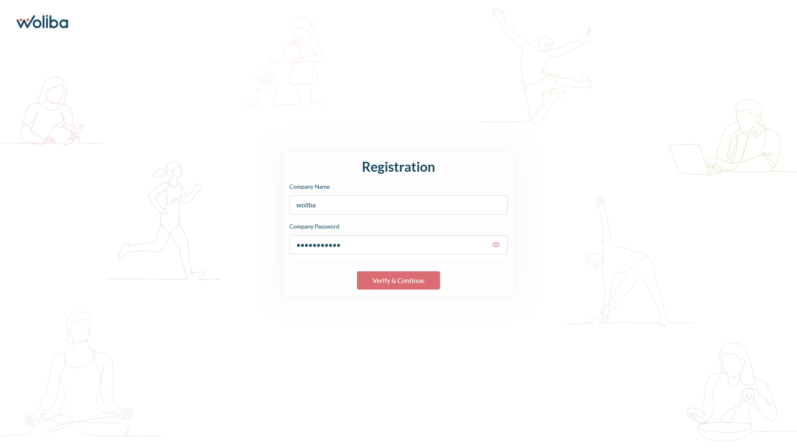
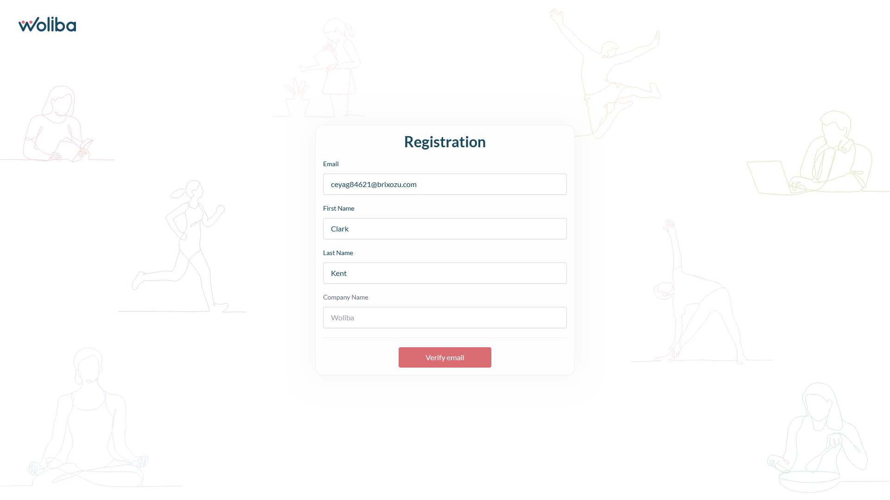
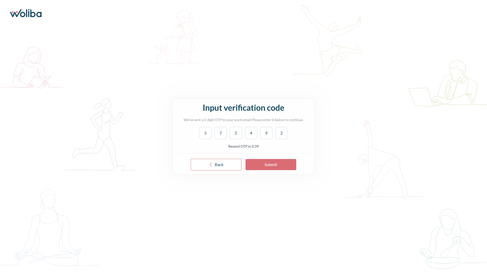
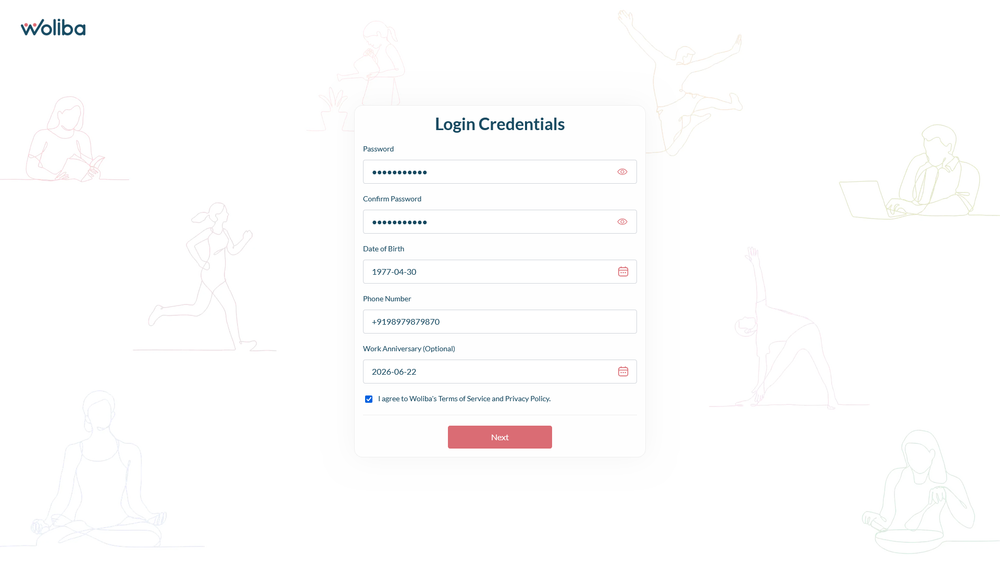
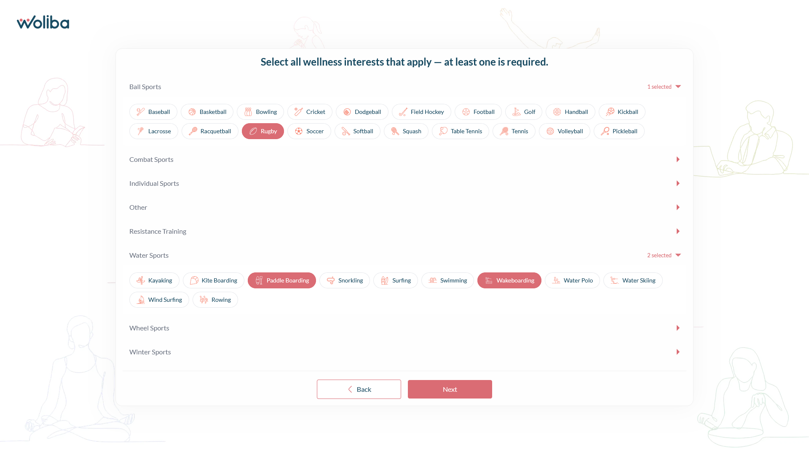
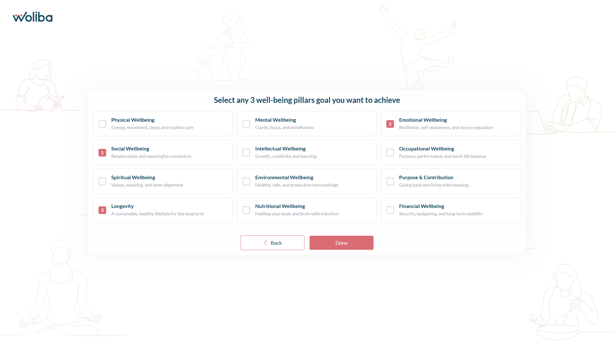

# Woliba User Registration Flow

A multi-step user registration web application built for the Woliba React Coding Challenge. The app follows the provided Figma design and integrates with the Woliba registration APIs.

## Live demo

> `https://wlba-fe.vercel.app/`

## App overview

Eight-step registration wizard:

1. Verify company name and password
2. Save user details and send OTP
3. Verify 6-digit OTP (with resend countdown)
4. Set login credentials and profile (DOB, phone, terms)
5. Select wellness interests (multi-select)
6. Select exactly 3 wellbeing pillars
7. Submit registration (loader video)
8. Welcome screen with user details

**Test credentials (from assignment docs):**

- Company: `Woliba`
- Password: `Woliba@123!`

## Setup instructions

### Prerequisites

- Node.js 18+
- npm 9+

### Install and run locally

```bash
npm install
npm run dev
```

Open `http://localhost:5173` (default Vite port).

### Production build

```bash
npm run build
npm run preview
```

## Libraries and tools


| Package                     | Purpose                            |
| --------------------------- | ---------------------------------- |
| React 19                    | UI (functional components + hooks) |
| Redux Toolkit + react-redux | Global registration state          |
| React Router DOM            | Routing (`/` registration flow)    |
| Axios                       | HTTP client for Woliba APIs        |
| react-toastify              | Toast notifications                |
| react-datepicker            | Date of birth and work anniversary |
| Vite                        | Dev server, build, API proxy       |


## Folder structure

```
src/
├── api/                 # Axios clients and registration API functions
├── assets/              # Images, icons, loader video, background
├── components/
│   ├── steps/           # StepOneCompany … StepEightWelcome
│   ├── ui/              # TextField, OtpInput, buttons
│   ├── LoaderVideo.jsx
│   └── RegistrationSteps.jsx
├── pages/
│   └── RegistrationPage.jsx
├── redux/
│   ├── registrationSlice.js
│   └── store.js
├── styles/
│   └── app.css
├── utils/               # validation, apiError, registrationOptions
├── App.jsx
└── main.jsx
```

## Screenshots

Registration flow (`docs/screenshots/`):

| Step                  | File                      |
| --------------------- | ------------------------- |
| 1 – Company verify    | `step1.png`               |
| 2 – User details      | `step2.png`               |
| 3 – OTP               | `step3.png`               |
| 4 – Profile           | `step4.png`               |
| 5 – Interests         | `step5.png`               |
| 6 – Pillars           | `step6.png`               |
| 7 – Submitting loader | `step7(loading).png`      |
| 8 – Welcome           | `step8(completed).png`    |

### Step 1 – Company verify



### Step 2 – User details



### Step 3 – OTP



### Step 4 – Profile



### Step 5 – Interests



### Step 6 – Pillars



### Step 7 – Submitting loader


### Step 8 – Welcome


API calls use same-origin `/v1`, proxied to `https://dev.api.woliba.io` via `vercel.json` on Vercel and via `vite.config.js` locally (avoids CORS).

## Assumptions

- API base URL uses `https://dev.api.woliba.io/v1` (staging host was unreachable during development).
- Wellness interest icons use CloudFront base URL from API documentation.
- Interest and pillar lists fall back to local defaults if fetch fails.

## AI usage

See [AI_USAGE.md](./AI_USAGE.md) for tools and disclosure required by the assignment.